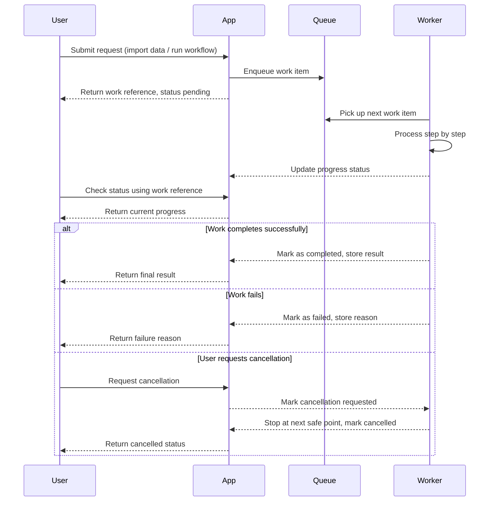

# Tabular Hub

The web app for [Tabular Manner](https://github.com/Minh1billion/tabular-manner).

Tabular Hub is a web application that lets users build and run data processing workflows for tabular data without writing code. Users design a workflow by dragging and connecting processing steps on a visual canvas, then run it to transform input data into the desired output.

## What the application is for

Many tabular data tasks, such as filtering, transforming, aggregating, or combining multiple data sources, usually require writing scripts that get rewritten for every project. Tabular Hub lets these steps be described as a visual workflow that can be saved, reused, run multiple times, and tracked across runs.

## How it works, in general

Users sign in with an existing Google or GitHub account, so there is no separate password to create for the application.

After signing in, a user creates a personal work area called a Workspace. Each Workspace holds the data, the processing workflow, and the run history for a single project. Users can create multiple Workspaces, browse the list, open details, or remove one when it is no longer needed.

Inside a Workspace, users bring in tabular data from their own device to use as input. Once added, a dataset can be previewed, inspected, and managed under its own name, regardless of how large or small the file is.

Users design a processing workflow by picking from a set of built-in steps or steps they define themselves, arranging them on a canvas, and connecting them into a complete flow. This workflow can be saved and edited at any time.

Before running it for real, users can check whether the workflow is valid without affecting any data. When a workflow runs, the system processes the data step by step, users can follow the progress in real time, and they can stop it partway through if needed. Every run is fully recorded so it can be reviewed or looked up later for comparison.

## Basic flow of use

Sign in, then create or open a Workspace. Bring the data to be processed into that Workspace. Design a processing workflow by choosing and connecting the right steps. Check the workflow before running it to make sure there are no configuration errors. Run the workflow and follow its progress until it finishes. Review the results and the run history whenever needed.

## How background processing works

Some actions, such as importing a dataset or running a workflow, can take a while to finish. To keep the application responsive, these actions are not carried out immediately while the user waits. Instead, the app hands the work off to be done separately, and the user is told right away that the request has been accepted, then can watch it progress.

The overall pattern is as follows.

1. The user submits a request, such as importing a dataset or running a workflow.
2. The application accepts the request, places it in a queue of pending work, and immediately replies with a reference for that piece of work along with a pending status.
3. A separate worker process picks up the next item from the queue when it is free.
4. The worker carries out the work step by step, for example reading a dataset or running a workflow through each processing step in order.
5. As the worker makes progress, it updates the status of the work so the user can follow along in real time.
6. When the worker finishes, it records the final status, either completed or failed, along with the result or the reason for failure.
7. The user can check on the request at any time using its reference, and can also ask to stop it before it finishes, which the worker will honor at the next safe point in its work.

This separation means the application stays responsive while accepting new requests, and the actual processing happens independently in the background, one piece of work at a time.

