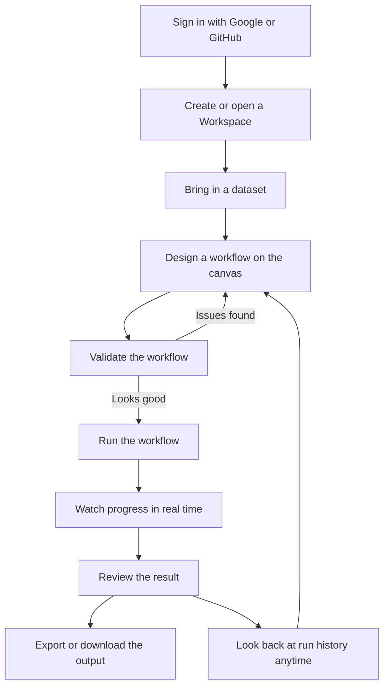
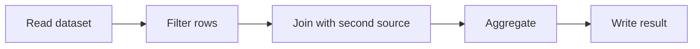
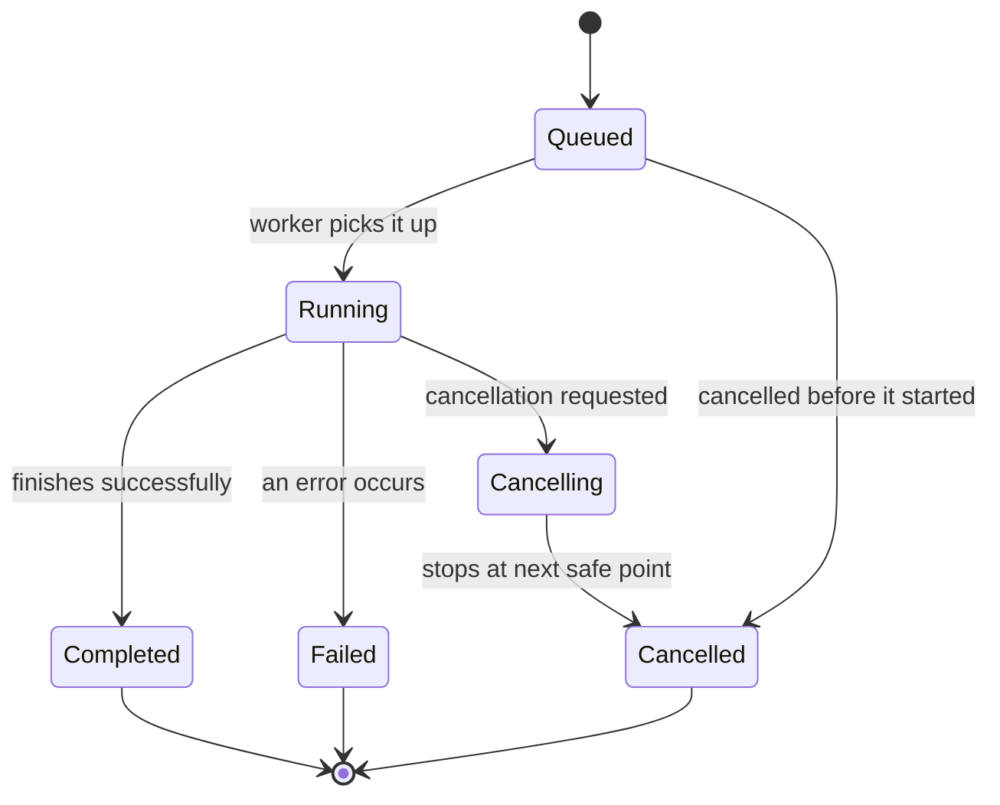

# Tabular Hub

The web app for [Tabular Manner](https://github.com/Minh1billion/tabular-manner).

Tabular Hub is a web application for building and running data processing workflows over tabular data, without writing code. Users design a workflow visually by connecting processing steps on a canvas, then run it to turn raw input data into the output they need - and can revisit every run afterward to see exactly what happened.

## Table of contents

- [Why Tabular Hub](#why-tabular-hub)
- [Core concepts](#core-concepts)
- [End-to-end journey](#end-to-end-journey)
- [Signing in](#signing-in)
- [Workspaces](#workspaces)
- [Bringing in data](#bringing-in-data)
- [Designing a workflow](#designing-a-workflow)
- [Validating and running a workflow](#validating-and-running-a-workflow)
- [Following and controlling a run](#following-and-controlling-a-run)
- [Getting results out](#getting-results-out)
- [How background work is handled](#how-background-work-is-handled)
- [Plans and usage limits](#plans-and-usage-limits)

## Why Tabular Hub

Filtering, cleaning, joining, and reshaping tabular data are things almost every project needs, but they are usually solved with one-off scripts that get rewritten each time. Tabular Hub turns this kind of work into a visual, reusable workflow: build it once, save it, run it again whenever the input changes, and always know what happened in every past run.

It is aimed at anyone who needs to process tabular data - CSVs, exports, reports - without setting up a coding environment, as well as at technical users who want a shareable, auditable way to describe repeatable data pipelines.

## Core concepts

Tabular Hub is organized around a few simple ideas:

- **Workspace** - a personal project area. Everything below belongs to a workspace: its data, its workflow, and its history of runs. A user can have several workspaces, one for each project.
- **Resource** - a dataset that has been brought into a workspace. Each resource has a name and can be previewed and inspected independently of the workflow.
- **Workflow** - a set of processing steps ("nodes") arranged on a canvas and connected in the order data should flow through them. A workflow can be saved, reopened, and edited at any time.
- **Node** - a single processing step in a workflow, such as reading a dataset, filtering rows, joining two sources, or writing a result. Some nodes are built in; users can also define their own custom steps to reuse across workflows.
- **Run** - one execution of a workflow (or of an import/export operation) against real data. Every run is recorded with its status and a timeline of what happened, so it can be reviewed or compared later.

## End-to-end journey

## Signing in

There is no separate account or password to create for Tabular Hub. Users sign in with an existing Google or GitHub account, and the app uses that identity going forward.

## Workspaces

After signing in, a user creates a Workspace for each project they want to keep separate. Inside the workspace list, a user can:

- create a new Workspace,
- browse existing ones,
- open a Workspace to work inside it,
- or remove a Workspace that is no longer needed.

Everything a user does afterward - bringing in data, building a workflow, running it - happens inside a chosen Workspace, and stays scoped to it.

## Bringing in data

Inside a Workspace, users bring in tabular data from their own device to use as input for a workflow. Once added, a dataset:

- is given its own name inside the workspace, so it can be referred to by that name from the workflow,
- can be previewed and inspected - browsing rows and columns - before it's used anywhere,
- can be replaced or removed later,
- is handled the same way regardless of how large or small the file is, since bringing in a large file happens in the background rather than blocking the user (see [How background work is handled](#how-background-work-is-handled)).

## Designing a workflow

A workflow is built by picking processing steps from a library - either built-in steps or ones a user has defined themselves - and placing them on a canvas. Steps are then connected in sequence to describe how data should move and transform from input to output.

A workflow can be saved at any point and reopened later for further edits - it doesn't need to be finished or runnable to be saved. Users who need a transformation that isn't covered by a built-in step can define their own reusable step and use it in any workflow, the same way as a built-in one.

## Validating and running a workflow

Before committing to a real run, a user can validate a workflow. Validation checks that the steps are connected correctly and configured with everything they need, without touching any actual data or producing any output. If something is missing or misconfigured, validation reports what and where, so it can be fixed before running for real.

Once a workflow is ready, running it processes the data step by step, in the order laid out on the canvas, and produces the configured output.

## Following and controlling a run

While a run is in progress, its progress can be followed in real time - a user can see which step is currently being worked on and what has completed so far. If a run is no longer needed, it can be stopped partway through; the system honors the request at the next safe point rather than in the middle of a step.

Every run - whether it finishes, fails, or is cancelled - is kept in the workspace's run history along with a timeline of what happened during it. This makes it possible to look back at any past run, see exactly what it did, and compare it with others.

## Getting results out

The output of a run stays available as a resource inside the workspace, where it can be previewed the same way as any other dataset. When a user is ready to take a result outside the app, they can export it, and once the export finishes, download it to their own device.

## How background work is handled

Some actions - bringing in a large dataset, or running a workflow - can take a while to finish. Rather than making the user wait for these to complete before responding, Tabular Hub accepts the request immediately, hands the actual work off to be carried out separately, and lets the user follow its progress from there.

The general pattern:

1. A user submits a request - bringing in a dataset, or running a workflow.
2. The app accepts the request, places it in a queue of pending work, and immediately confirms it was received, with a "pending" status.
3. A worker, running independently, picks up the next item from the queue when it's free.
4. The worker carries out the work step by step - for example, reading a dataset, or running a workflow through each of its steps in order.
5. As it makes progress, the worker keeps the status updated, so the user can follow along without needing to wait.
6. When it's done, the worker records the final outcome - completed or failed - along with the result or the reason for failure.
7. At any point, the user can check on the status of the work, and can also ask for it to be stopped, which the worker honors at its next safe point.

```mermaid
sequenceDiagram
    participant User
    participant App
    participant Queue
    participant Worker

    User->>App: Submit request (bring in data / run workflow)
    App->>Queue: Add to queue
    App-->>User: Confirm receipt, status: pending

    Worker->>Queue: Pick up next item
    Worker->>Worker: Work through it step by step
    Worker-->>App: Update progress

    User->>App: Check status at any time
    App-->>User: Current progress

    alt Finishes successfully
        Worker-->>App: Mark completed, store result
        App-->>User: Deliver result
    else Fails
        Worker-->>App: Mark failed, store reason
        App-->>User: Report failure reason
    else User cancels
        User->>App: Request cancellation
        App-->>Worker: Flag for cancellation
        Worker-->>App: Stop at next safe point, mark cancelled
        App-->>User: Confirm cancelled
    end
```

This separation keeps the app responsive to new requests at all times, while the actual processing happens independently, one piece of work at a time.

## Plans and usage limits

Tabular Hub offers a free tier as well as paid plans for people who need more room to work with. Plans differ in how many Workspaces a user can keep at once, how large a single dataset can be, and how much data can be stored across a workspace in total.

| Plan | Workspaces | Max size per dataset | Total storage per workspace |
| --- | --- | --- | --- |
| **Free** | 1 | 50 MB | 500 MB |
| **Pro** | 10 | 500 MB | 20 GB |
| **Team** | 50 | 2 GB | 200 GB |

A user's current usage against their plan's limits is visible from within the app, and upgrading or managing a subscription can be done at any time from the billing section.
